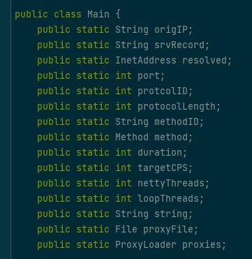

<p align="center"></p>
<h1 align="center"> DDoS attack minecraft servers with 24 Method</h1>

## Instructions
- Get new proxies at [Proxy Checker](https://checkerproxy.net/), paste in proxies.txt
- Open your favourite terminal
- `java -jar MCBOT.jar <IP:PORT> <PROTOCOL> <METHOD> <SECONDS> <CPS>`
- You can get protocol version at [Protocol Version numbers (wiki.vg)](https://wiki.vg/Protocol_version_numbers)
- If you have fast internet connection, you would set your cps to -1 to improve the performance 

## Methods
```💣 Methods:
bigpacket
botjoiner
doublejoin
emptypacket
gayspam
handshake
invaliddata
invalidspoof
invalidnames
spoof
join
legacyping
legitnamejoin
localhost
pingjoin
longhost
longnames
nullping
ping
query
randompacket
bighandshake
unexpectedpacket
memory
test
```
## WARNING
- Use this script for educational purposes only or to test your server!
- This software is a piece of junk, do not use it in production!


